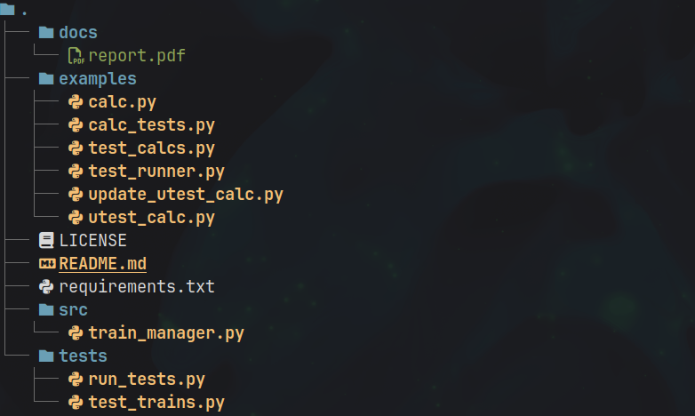

# Лабораторная работа №2 (2.22)
**Предмет** Объектно-ориентированное программирование  
**Тема:** Тестирование в Python [unittest]  
**Вариант:** 8  

## Содержание

1. [Описание работы](#цель-работы)  
2. [Ссылка на отчет](#ссылка-на-отчет)  
3. [Структура репозитория](#структура-репозитория)  
4. [Задания](#задания)  

---

## Цель работы

Приобретение навыков написания автоматизированных тестов на языке программирования Python версии 3.x.

---

## Ссылка на отчет

[Отчет о выполнении лабораторной работы](docs/report.pdf)

---

## Структура репозитория

- `docs/` — отчет по лабораторной работе
- `examples/` — примеры из лабораторной работы  
- `src/` — исходный код программы
- `tests/` — unit тесты
- `requirements.txt` — список зависимостей

---

## Задания

### Индивидуальное задание
[Исходный код задания](tests/test_trains.py)

Для индивидуального задания лабораторной работы 2.21 добавьте тесты с использованием
модуля unittest, проверяющие операции по работе с базой данных.

### Задание из ЛР 2.21

Для своего варианта лабораторной работы 2.17 необходимо реализовать хранение данных в
базе данных SQLite3. Информация в базе данных должна храниться не менее чем в двух
таблицах.

### Задание из ЛР 2.17

Для своего варианта лабораторной работы 2.16 необходимо дополнительно реализовать
интерфейс командной строки (CLI).

### Задание из ЛР 2.16

Для своего варианта лабораторной работы 2.8 необходимо дополнительно реализовать
сохранение и чтение данных из файла формата JSON. Необходимо также проследить за тем,
чтобы файлы генерируемый этой программой не попадали в репозиторий лабораторной
работы.

### Задание из ЛР 2.8

Решить индивидуальное задание лабораторной работы 2.6, оформив каждую команду в виде
отдельной функции.

### Задание из ЛР 2.6

Составить программу с использованием списков и словарей для решения задачи. 

Использовать словарь, содержащий следующие ключи: название пункта назначения; номер
поезда; время отправления. Написать программу, выполняющую следующие действия: ввод
